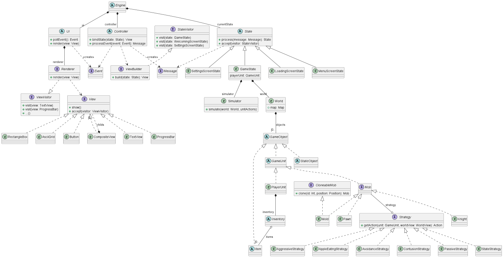

## Общие сведения об игре

Игра с видом сверху на клетчатом поле любого размера (на экране видна только его часть).
Цель игры — пройти уровень от входа до выхода.
Пользователь управляет персонажем, перемещаясь по карте и взаимодействуя с различными игровыми объектами (например, стена, монетка, враг, вещь и т.д).

Игра является пошаговой, то есть всё взаимодействие пользователя с логикой происходит синхронно в одном потоке (возможно, то изменится).

Объект типа вещь игрок может подобрать себе в инвентарь.
Вещь из инвентаря игрок может "надеть" на себя, при этом изменяются какие-то способности/характеристики (например, игрок ускоряется или получает возможность проходить сквозь стены).
При снятии вещи, она возвращается в инвентарь.

Есть вещи с одноразовым эффектом, например яблоки, увеличивающие количество здоровья.

Также в игре есть мобы, передвигющиеся по полю так же, как игрок. Игрок и мобы могут атаковать друг друга, нанося урон соответствующий их параметрам.

При запуске игры инициализируется уровень: объекты и их положение либо случайно генерируются, либо подгружаются из файла.

После смерти персонажа игра завершается, и надо начинать сначала.

## Правила игры
###Условные обозначения на поле:
- Игрок (P)
- Стена (#) -- непроходимое препятствие.
- Моб (M) -- противник игрока, передвигющийся по полю так же, как игрок. Игрок и моб могут атаковать друг друга, нанося урон соответствующий их параметрам. (Правила боя смотри ниже).
- Активный колодец (W) -- непроходимое препятствие, которое можно использовать для повышения уровня. 
- Неиспользованный колодец (w) -- непроходимое препятствие, использованный колодец.
- Яблоко (A) -- вещь, используется для поднятия здоровья, применятеся сразу же.
- Меч (S) -- вещь, используется для увеличения атаки и контузии мобов, помещается в инвентарь.
- Дверь (D) -- когда игрок попадает в эту клетку, уровень считается пройденным.

### Игрок
#### Характеристики: 
- Здоровье (число от 0 до 9). Когда здоровье становится равно 0, игрок умирает, игра заканчивается поражением.
- Атака. Этот коэффициент будет вычитаться из здоровья моба при нападении на него игроком.
- Опыт. Опыт увеличивается на 1, когда игрок убивает моба. Если опыт становится равен 3, уровень игрока повышается.
- Уровень. При переходе на новый уровень игрок получает: +1 к атаке, +1 к здоровью.

Все эти параметры можно посмотреть в нижней части экрана.

#### Ход
Каждый ход игрок может выполнить одно из следующих действий:
1. Переместися по полю, в клетку, соседнюю по стороне при помощи клавиши стрелки. При этом:
  - Если клетка занята непроходимым препятствием, игрок не может попасть в клетку.
  - Если в клетке находится яблоко, здоровье игрока увеличивается на 1, но не может превысить максимальный уровень равный 9.
  - Если в клетке находится меч, меч подбирается в инвентарь.
  - Если в клетке находится моб, игрок нападает на моба. Здоровье моба уменьшается на уровень атаки игрока.
  - Если в клетке находится дверь, игра заканчивается победой игрока.
2. Если игрок стоит у колодца, он может воспользоваться колодцем, нажав клавишу e. После этого игрок переходит на новый уровень, а колодец деактивируется. Второй раз воспользоваться им нельзя.
3. Если у игрока в инвентаре есть меч, игрок может взять меч в руку, нажав клавишу 1. После этого атака игрока увеличивается на 1, а также при нападении на мобов, мобы получают контузию.
4. Если у игрока в руке есть меч, игрок может вернуть меч в инвентарь, нажав клавишу 1. После этого действие меча отменяется.

Важно отметить, что если игрок нажимает одну из описанных выше клавиш, не соблюдая при этом правила игры (например, нажимает e, когда в соседней клетке нет колодца), ход считается пропущенным.

### Мобы
#### Характеристики
У мобов есть следующие характеристики:
- Здровье (число от 0 до 9). Когда здоровье становится равным 0, моб погибает. Чтобы узнать здоровье моба, нажмите q. На экране каждый моб будет отображаться в виде зеленой цифры равной его здоровью. Чтобы выйти из этого режима, повторно нажмите q.
- Атака. Это число вычитается из здоровья игрока, когда моб нападает на него. Чтобы узнать атаку моба, нажмите w. На экране каждый моб будет отображаться в виде красной цифры равной его атаке. Чтобы выйти из этого режима, повторно нажмите w.

#### Ход

После каждого хода игрока каждый моб передвигается на соседнюю клетку поля или остается на месте. При этом:
- Моб не может переместиться в клетку с непроходимым препятствием.
- Если моб проходит через клетку с яблоком, он портит его. То есть яблоко исчезает с поля, но здоровье моба не повышается.
- Если моб проходит через клетку с мечом, он ломает его. То есть меч изсчезает с поля, но характеристики моба не меняются.
- Если моб наступает на клетку с другим мобом, начинается бой. Из здоровья второго моба вычитается атака первого.
- Если моб наступает на клетку с игроком, начинается бой. Из здоровья игрока вычитается атака моба.
- Дверь для моба является непроходимым препятствием.

#### Контузия
Если на моба нападает игрок с мечом, моб контузится и начинает передвигаться по полю рандомно. Эффект длится 5 ходов. Контуженный моб изображается буквой m.

## Architectural drivers

- Технические ограничения: 
  - необходимо кроссплатформенное решение
- Ограничения по срокам:
  - добавлять новые возможности в игру каждые пару недель
  - закончить проект до середины декабря
- Функциональные требования:
  - консольная графика
  - минимум 60fps
  - генерация карт
- Атрибуты качества:
  - расширямая архитектура
  - unit-тесты
  - понятный код

## Описание типичного пользователя

- Знаком с жанром roguelike 
- Опытный игрок, которому важна сложность прохождения, а не сюжет или графика
- Привык проходить игры на одной только клавиатуре
- Готов разбираться с большим набором правил и игровых механик

## Диаграмма компонентов

Движок состоит из трёх основных действующих сущностей:

- `UI` содержит логику по рендерингу представления на консоль, а также обрабатывает действия пользователя с этим представлением (например, нажатия клавиш).
- `State` содержит внутреннее представление стейта и умеет изменять его на основе полученных сообщений. Игровая логика и все игровые данные будут содержаться в `GameState`.
- `Controller` связывает `UI` и `State`: умеет генерировать представление `State` для `UI`, а в обратную сторону преобразует примитивные действия пользователя (например, "нажата клавиша" или "выбран элемент из списка") в восокоуровневые сообщения для `State`. 

## Диаграмма классов

### Engine

Входная точка в программу, занимающаяся конфигурированием основных сущностей. Содержит основный цикл игры, хранит текущий `State`.

Состоит из:

- Компоненты `UI` 
- Компоненты `Controller`
- Хранит текущий `State`
- Набор некоторых вспомогательных классов, например, `AssetManager`

Отвечает за коммуникацию между `UI` и `Controller`, а также `Controller` и `State`.

### AssetManager

Вспомогательный класс, позволяющий загружать с диска различные файлы с данными, например, карты, характеристики и т. д.

### UI

Абстрактный класс, содержащий в себе всё взаимодействие с пользователем.

- Состоит из `Renderer`а
- Умеет получать примитивные `Event`ы, связанные с действиями пользователя:
  - Выбран элемент из списка
  - Нажата клавиша
  - Введено слово
  - etc.

Движок использует этот класс для отрисовки `View`, а тот в свою очередь, делегирует это `Renderer`у. Также движок использует этот класс
для получения UI событий, после чего передаёт эти события `Controller`у.

### Renderer

Интерфейс, предназначенный для отрисовки `View`. Реализация будет рендерить `View` на консоль.
Потенциально, можно реализовать и высокоуровневую графику.

### View

Абстрактный класс, представляющий базовую сущность рисования. Реализует паттерн "компоновщик". Потенциальные наследники:
 - `TextView`
 - `ProgressBar`
 - `RectangleBox`
 - `AsciiGrid`
 - `Button`
 - `CompositeView`

### Controller

Абстрактный класс, связывающий между собой внутренние модели игры и их представление:
 - Функция `bind(state: State): View` используется для получения `View` для текущего состояния. Для этого может использоваться
вспомогательный класс `ViewBuilder`. Движок вызывает эту функцию, когда хочет вывести пользователю какой-то `State`.
 - Функция `processEvent(event: Event): Message` получает UI событие и преобразует его в сообщение для текущего `State`. Например, "нажата клавиша <стрелочка вправо>" преобразуется в "сместить игрока вправо".

Функция `bind` может запоминать необходимые элементы `View`, чтобы потом корректно обработать `UI` событие.

### State

Состояние игры, содержащие все необходимые для корректной работы данные внутри себя.
Клиент (`Engine`) передаёт некоторое сообщение (`Message`), состояние обрабатывает это сообщение, изменяя свои внутренние данные, и возвращает следующие состояние, возможно, себя же. 
Для этого вызывается функция `process(Message): State`. Сообщения параметризуются конкретным типом состояния, то есть
у каждого состояния свой набор принимаемых сообщений.

Примеры:
- `MenuScreenState`
- `GameState`
- `VictoryScreenState`
- `DefeatScreenState`

#### Диагарамма состояний:

Наибольший интерес представляет `GameState`.

### GameState

Содержит в себе текущие игровые данные и классы, реализующие основные игровые механики:

- Симулятор `Simulator`
- Игровый мир `World`
- Список стратегий для юнитов с икуственным интеллектом

По сути, реализует основную игровую логику одной итерации цикла.

Сообщением для `GameState` может быть, например, "игрок открыл инвентарь", "игрок передвинулся куда-то" или "игрок открыл меню".

### World

Содержит текущее состояние игрового мира:

- Карта в каком-то виде
- Список игровых объектов
- Список продолжительных эффектов
- Текущее время

### GameUnit

Абстрактный класс, соответствующий игровому юниту.
Наследники:
- `Mob`
- `PlayerUnit`

### Strategy

Реализует поведение какого-либа юнита. Пользовательские действия тоже могут быть описаны этим интерфейсом. `GameState` для каждого юнита вычисляет
нужную стратегию, а затем у этой стратегии вызывает метод `getAction(unit, world)`, возврщающий действие юнита.

Потенциально стратегия может получать `WorldView` вместо `World`, но пока этой функциональности нет.
`WorldView` -- по сути некоторый иммутабельный кусок мира, который доступен юниту. Это позволяет реализовать, например, туман войны и прочие механики.

Стратегия хранится как поле юнита.

### Simulator

Реализация этого класса отвечает за обновление мира на основе действий юнитов. Именно здесь происходят все вычисления игровых механик.

## Диаграмма последовательностей

Когда пользователь запускает игру, `Engine` инициализирует начальный `GameState`.

Далее, в бесконечном цикле, `Engine` получает текущий актуальный `GameState`, отправляет его контроллеру, чтобы тот на ешо основе сконструировал `View`, которое `Renderer` отобразит на экране. 

Пользователь может совершить действие, например, нажать кнопку на клавиатуре.
Тогда `Engine` получит соответствующее событие от `Controller`, передаст его `GameState`, чтобы тот вернул новое состояние.

[//]: # (## Диаграмма конечных автоматов)

[//]: # ()
[//]: # (![image]&#40;https://user-images.githubusercontent.com/54814796/199162111-03b7e2ed-9196-4a5e-8b40-df8b391c4e3f.png&#41;)

[//]: # ()
[//]: # (- Игрок начинает в состоянии Idle.)

[//]: # (- При нажатии на клавиши перемещения происходит переход в состояние Moving, в котором игрок двигается по карте. Перед выходом из Moving игрок останавливается.)

[//]: # (- При нажатии клавиши атаки, если текущее состояние — Idle или Move, игрок изменяет состояние на Attack, в котором атакует, после чего возвращается в то состояние, в котором был. )

[//]: # (- При получении урона игрок меняет состояние на Hurt, уменьшает количество своего здоровья, после чего возвращается в то состояние Idle. Если здоровье стало равным нулю, то игрок переходит в состояние Die.)

